# Modern Chat

A total reworking of the 1.8.9 chat, providing tons of features from the modern game and various QoL improvements.

# Version 1.0.0 — First Release!
Let me know what you all think. If you notice any bugs, please report them on the issues page of the GitHub.

## Features
This mod, in addition to its own changes, compiles features from many different mods into one:
- [Chat Autocomplete System](#autocomplete-system)
  - [Server Command Autocomplete](#server-command-autocomplete)
  - [Friend Name Autocomplete](#friend-name-autocomplete)
- [Smooth Chat Animations](#smooth-chat-animations)
- [Raise Chat](#raise-chat)
- [Extended Chat History](#extended-chat-history)
- [Compact Chat Spam](#compact-chat-spam)
- [Maintain Chat History](#maintain-chat-history)
- [Replace Angle Brackets](#replace-angle-brackets)
- [Preserve Chat Input](#preserve-chat-input)

Many of these features are also present in the [Chat Patches](https://modrinth.com/mod/chatpatches) mod by OBro1961. However, Chat Patches is only compatible with modern version of the game. Modern Chat is built for Legacy Fabric 1.8.9. 
___

## Configuration Overview
This mod is also highly customizable. To access the config menu, the default keybind is `P`. This can be modified in the game's control settings.

- [Mod Configuration](#mod-configuration)
  - [Suggestion Color Configuration](#suggestion-color-configuration)
  - [Friend List Configuration](#friend-list-configuration)
  - [Command Syntax Configuration](#command-syntax-configuration)
    - [Installing Server Syntaxes](#installing-server-syntaxes)
___

## Developer Overview
This mod can also be configured manually with a little technical know-how.
- [Developer Details](#developer-details)
  - [Creating Friend List JSONs](#creating-friend-list-jsons)
  - [Creating Command Syntax JSONs](#creating-command-syntax-jsons)

## Autocomplete System
Based on modern Minecraft's autocomplete, the mod adds a chat suggestion box above the typing line, allowing you to chat faster!

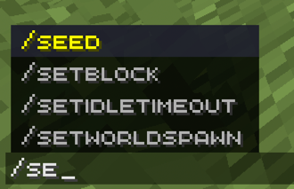

Pressing the `UP` and `DOWN` arrow keys allows you to select different suggestions, which are automatically filled in the chat box. The suggestion highlighted in yellow is the one that is currently selected. Pressing `Tab` will commit the selected suggestion to the typing line.
___

### Server Command Autocomplete
The autocomplete system for this mod is highly configurable. This allows for various command syntax trees, allowing autocomplete suggestions to work on servers with custom commands.

In addition to singleplayer commands, the mod supports community-maintained server syntaxes that can be installed in a few clicks directly from the in-game menu. See [Installing Server Syntaxes](#installing-server-syntaxes) for more details.

Supported servers display chat autocomplete suggestions just like singleplayer commands, in their unique color:

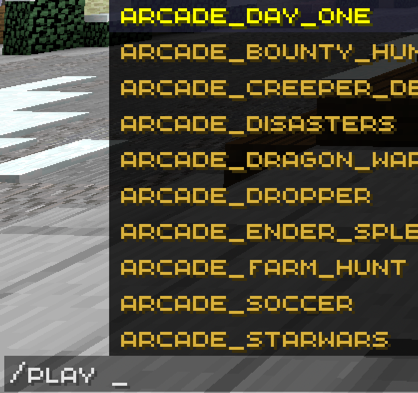

The autocomplete commands also support `Tokens`, which are specific parameter keywords that trigger special searches in the parsing engine. For example, if I were to type the command:

`/give <player> <item>`

This would trigger two token searches. The first token search, `<player>`, will grab all active player names in the tab menu and list them as suggestions. Players who are not currently active can still appear here (see [friend name autocomplete](#friend-name-autocomplete)). Next, `<item>` will trigger an item token search, which will display all available items in the game.

Each server is given a unique `.json` file, containing an identifier and color, proceeded by the syntax tree. The mod reads this `.json` file and parses it to generate the autocomplete suggestions. If you wish to see more details regarding the format, take a look at the [dev details](#developer-details) near the bottom.
___

### Friend Name Autocomplete
In addition to server commands, friend names can also be autocompleted. Each server gets its own unique friends list. When a command syntax requests a player username as an input (parameter), the autocomplete mod suggestions friend names to autocomplete. This is useful for speeding up repetitive commands, such as messaging a player, inviting them to a party, etc., when they are not in the same lobby as you or are not online.

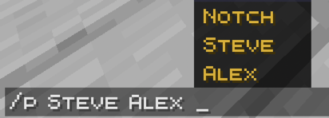

Just like server syntaxes, friend names are also read from a `.json` file (albeit a much simpler one). For more details on this, read the [dev details](#developer-details) at the bottom.
___

## Smooth Chat Animations
_Inspired by the Chat Animation (Smooth Chat) mod by Ezzenix_

Modern Chat implements a smooth animations for the typing line and chat messages as they appear.


Check out the original mod here: https://modrinth.com/mod/chatanimation
___

## Raise Chat
_Inspired by the Chat Up! mod by Gnembon_

This mod adds a simple tweak to the chat positioning. To prevent overlap with health and armor bars, this tweak raises the chat so it no longer obstructs view of these elements.

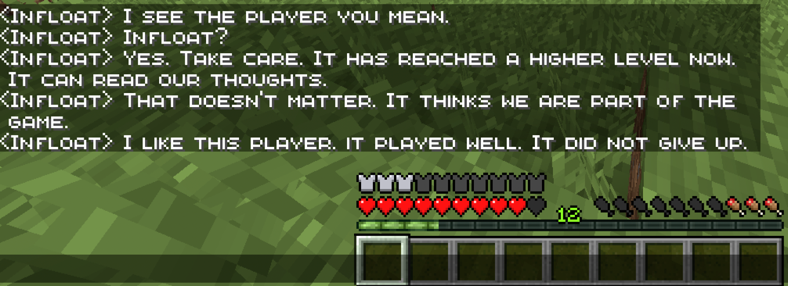

Check out the original mod here: https://www.curseforge.com/minecraft/mc-mods/chat-up
___

## Extended Chat History
_Inspired by the More Chat History mod by JackFred_

Modern Chat allows an option to increase (or decrease, if you want) your chat history length, ranging from 10 to 16384. Now you can scroll back (pretty much) infinitely without worrying about losing your messages!

Check out the original mod here: https://modrinth.com/mod/morechathistory
___

## Compact Chat Spam
_Inspired by the ClearSpam mod by Ruukas and the Compact Chat mod by caoimhe_

Modern Chat prevents spam messages in the chat by compacting them into one line and adding a simple multiplier to show how many times that message has been sent.

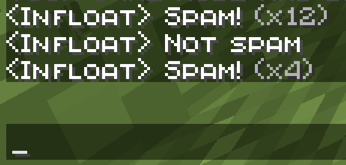

Check out the original mods here:
https://www.curseforge.com/minecraft/mc-mods/clearspam
https://modrinth.com/mod/compact-chat
___

## Replace Angle Brackets
_Inspired by the No Angled Brackets mod by Flytre7_

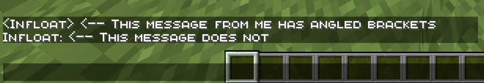

Check out the original mod here: https://www.curseforge.com/minecraft/mc-mods/no-angled-brackets
___

## Maintain Chat History
_Inspired by the Don't Clear Chat History mod by anar4732_

Normally, leaving worlds and servers wipes your entire chat history, leaving you with a blank chat window and no way to recover what was said. Modern Chat prevents this from happening by blocking forced chat clears, so your chat history remains preserved.

Check out the original mod here: https://www.curseforge.com/minecraft/mc-mods/dont-clear-chat-history
___

## Preserve Chat Input
_Inspired by the LetMeSpeak mod by spacebyte_

On many servers, there are certain events in the game that can close your chat while you're typing. This can be frustrating, since it erases your chat and can't be restored. Modern Chat resolves this by preserving message when the chat is forcefully closed. `Esc` and `Enter` still close the chat normally, without saving it.

> **NOTE:** since LetMeSpeak a mod that is already compatible with LegacyFabric, Modern Chat acts as a _replacement_ for this mod.

Check out the original mod here:
https://modrinth.com/mod/letmespeak
___

# Mod Configuration
As mentioned before, there is a lot of customization with this mod. To access the config screen, press `P` (default keybind):

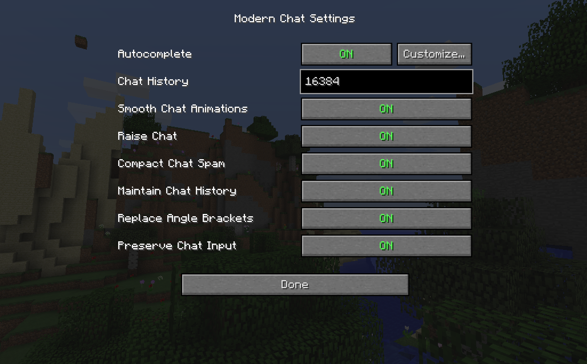

Here, you can toggle the following options, which we explained above:
- Autocomplete: `ON/OFF`
- Chat History: `10 - 16384`
- Smooth Chat Animations: `ON/OFF`
- Raise Chat:`ON/OFF`
- Compact Chat Spam: `ON/OFF`
- Replace Angle Brackets: `ON/OFF`
- Maintain Chat History: `ON/OFF`
- Preserve Chat Input: `ON/OFF`

Notice the `"Customize..."` button to the right of the autocomplete toggle. Here, we can find much deeper customizations for the autocomplete logic.

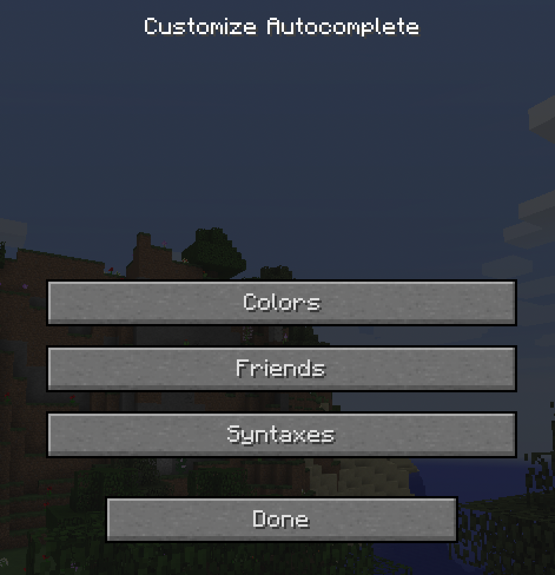

We will now dive deeper into all three.
___

### Suggestion Color Configuration
Remember from earlier that each server has its own id and color for the autocomplete. Here, you can modify the color of the autocomplete suggestions for each server.

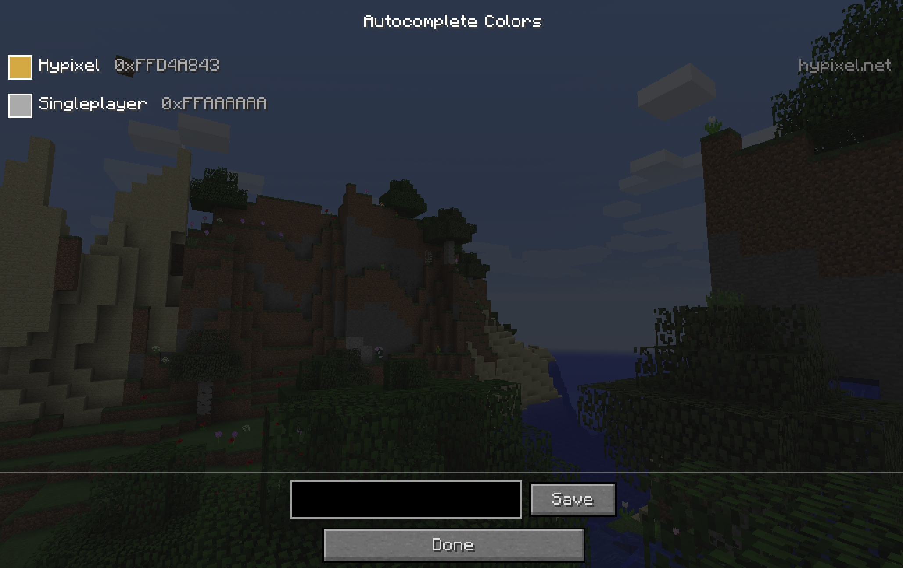

To change a color, simply select that server in the list, then adjust the hex color in the space below. The color is formatted as: `0xAARRGGBB`, where `AA` is the alpha value (ranging from `00` to `FF`), `RR` is the red value, `GG` is the green value, and `BB` is the blue value.

Once you are done editing the colors, hit `SAVE` and `DONE` to finalize your color adjustments.

Colors can also be adjusted directly in the config `.json` files; see [dev details](#developer-details) for more info.
___

### Friend List Configuration
Here, you can customize your friends list. As mentioned before, these are the names that will appear as suggestions when a command prompts you to enter the name of a player, triggered by the `<player>` syntax token.

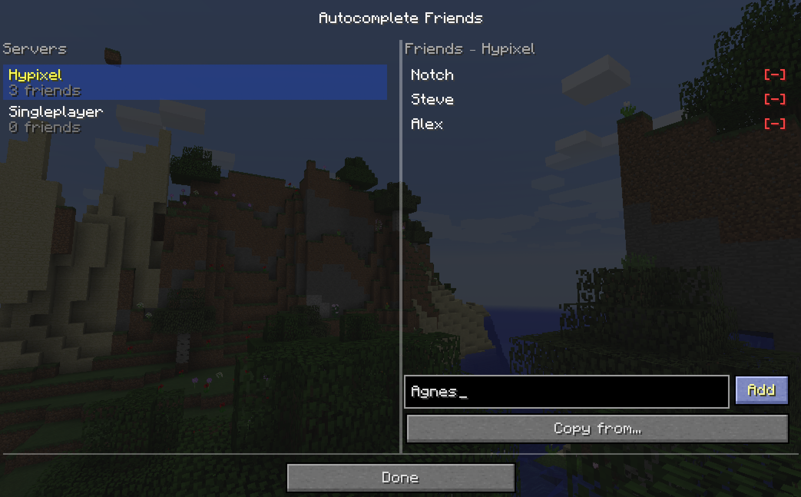

The config menu displays your servers list on the left and your friends list on the right. To add a friend, simply select the desired server you wish to add friends for. Once selected, the friends for that server will appear in the friends list. You can then add friends by typing their username (case sensitive) or copying from another server using the `Copy From...` button.

Friends can be removed from the list by clicking the red `[-]` next to each username.

Friends can be added directly by modifying the `.json` files; see [dev details](#developer-details) for more info.
___

### Command Syntax Configuration
Finally, the command autocomplete syntaxes themselves can be modified in full.

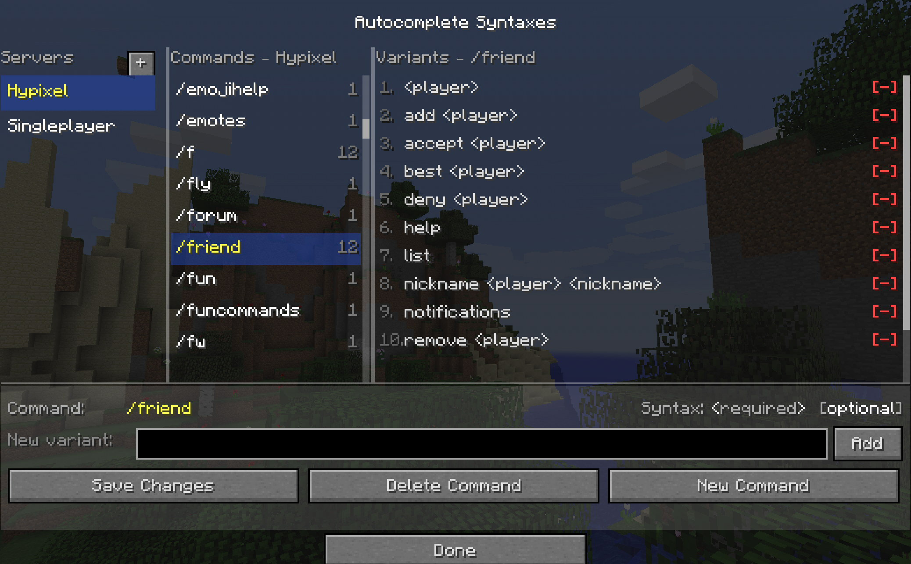

On the left, we have our servers list, just like the friends menu. In the middle column, we can select a particular command for the selected server. Finally, on the right side, we can modify a specific variant of that command in the syntax tree.

You can select a variant to edit it, or select none and add a new variant.

You can delete variants by pressing the red `[-]` button next to each variant. You can also delete and add new commands for each server.

The `+` button in the top-left of the Servers column header opens the syntax browser — see [Installing Server Syntaxes](#installing-server-syntaxes) below.

For more details on writing and editing function syntaxes, as well as how the `.json` files work, see [dev details](#developer-details).
___

#### Installing Server Syntaxes
The mod ships with only the singleplayer syntax installed by default. Additional servers can be installed through the in-game syntax browser, which fetches syntax definitions directly from GitHub.

To open the syntax browser, navigate to the **Command Syntax Configuration** screen and click the small `+` button next to the **Servers** column header.

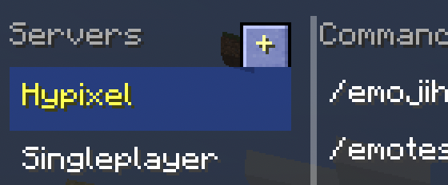

This opens the **Add Server** screen, which loads a list of available syntaxes from the GitHub. Select a server from the list and click **Install** to download and save its syntax to your config folder. Installed syntaxes are marked with a green `Installed` label.

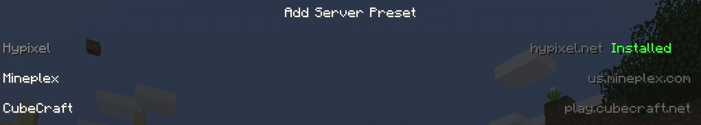

Syntaxes can also be **uninstalled** from this same screen. Select an installed syntax and click **Uninstall**. You will be asked to confirm, as this also removes the friend list for that server. Uninstalling a syntax also deletes any custom changes made to that syntax.

Once installed, a syntax behaves exactly like any other server syntax. It can be edited, recolored, and have friends added to it through the standard configuration menus.
___

## Developer Details

The mod stores all of its configurable data in two directories inside your game folder:

- `config/modernchat/commands/` — command syntax definitions
- `config/modernchat/friends/` — friend lists

Every `.json` file in the `commands/` folder is loaded automatically, in alphabetical order. A corresponding file with the **same filename** in the `friends/` folder is treated as that server's friend list.

> **Note:** `singleplayer.json` is created the first time you launch the mod if it does not already exist. If you delete the file, it will have to be redownloaded from the GitHub. Server syntaxes such as `hypixel.json` are not installed by default — use the [syntax browser](#installing-server-syntaxes) to install them, or create the files manually as described below.

___

### Creating Friend List JSONs

Friend list files live in `config/modernchat/friends/`. Each file corresponds to a command syntax file of the same name. For example, the friend list for `commands/myserver.json` is stored at `friends/myserver.json`.

The structure is minimal:

```json
{
  "friends": [
    "Notch",
    "Dinnerbone",
    "jeb_"
  ]
}
```

Each entry is a **case-sensitive** player username. These names are surfaced as autocomplete suggestions anywhere a command syntax uses a [player token](#tokens), even if the player is not currently in your tab list.

You can add friends here directly, or use the [Friend List Configuration](#friend-list-configuration) menu in-game; both write to the same file.

___

### Creating Command Syntax JSONs

Command syntax files live in `config/modernchat/commands/`. You can create as many as you want. Each file defines one server profile, including its display color, the server it applies to, and the full command tree.

Here is the complete structure with all available fields:

```json
{
  "name": "myserver",
  "ip": "play.myserver.net",
  "color": "0xFFAAAAAA",
  "disableSingleplayer": false,

  "commands": {
    "/mycommand": ["", "<player>", "<player> <message>"]
  },

  "coordCommands":            ["/mycommand"],
  "selectorCommands":         ["/mycommand"],
  "limitedSelectorCommands":  ["/mycommand"],

  "playerTokens":      ["<myCustomPlayer>"],
  "blockTokens":       ["<myCustomBlock>"],
  "enchantmentTokens": ["<myCustomEnchant>"],
  "effectTokens":      ["<myCustomEffect>"],
  "entityNameTokens":  ["<myCustomEntity>"],
  "itemTokens":        ["<myCustomItem>"],

  "enchantmentNames": {
    "0": "Protection",
    "16": "Sharpness"
  },

  "effectNames": {
    "1": "Speed",
    "5": "Strength"
  },

  "rankColors": {
    "/vip": "0xFF55FF55"
  }
}
```

Here is what each field does:

---

**`name`** _(string)_

A display label for the server. Used internally and shown in the in-game config menus.

---

**`ip`** _(string, optional)_

The hostname of the server this profile applies to. The port is stripped and the comparison is case-insensitive. Subdomains are matched automatically. For example, `"hypixel.net"` will match `mc.hypixel.net`.

If this field is **omitted**, the profile is treated as always-on and will load on every server, including singleplayer. This is how `singleplayer.json` works.

---

**`color`** _(string)_

The color of the autocomplete suggestion text for all commands in this profile. Accepted formats:

| Format | Example |
| --- | --- |
| `0xAARRGGBB` | `"0xFFD4A843"` |
| `#AARRGGBB` | `"#FFD4A843"` |
| `#RRGGBB` | `"#D4A843"` (alpha defaults to `FF`) |

This can also be changed through the [Suggestion Color Configuration](#suggestion-color-configuration) menu in-game.

---

**`disableSingleplayer`** _(boolean, optional)_

When set to `true`, the singleplayer command profile is suppressed while this server profile is active. This is useful on servers where singleplayer commands like `/give` and `/ban` would clutter the autocomplete. Defaults to `false`.

---

**`commands`** _(object)_

The command tree itself. Each key is a full command name (including the `/`), and its value is an array of syntax variants – the different argument patterns that command accepts.

```json
{
  "commands": {
    "/tp": [
      "<target>",
      "<player> <target>",
      "<x> <y> <z>",
      "<player> <x> <y> <z>"
    ]
  }
}
```

Each variant is a space-separated string of tokens. When you type a command, the engine looks at how many arguments you've already entered and checks which variants have a token at that position. Then it shows suggestions for all matching ones at once.

An empty string `""` means the command takes no arguments (or that no-argument usage should appear as a valid suggestion).

---

### Tokens

Tokens are the special `<...>` and `[...]` keywords inside a syntax variant. The parsing engine checks each token against a set of known names and triggers a different kind of autocomplete depending on which one it finds.

**Built-in player tokens**: suggests online players and friends:

- `<player>` — standard player argument
- `<address|player>` — used for `/ban-ip` style commands
- `<player|entity>` — accepts either a player or an entity
- `<target>` — generic target argument
- `<source>` — source player argument
- `<entity>` — entity argument (overlaps with entity name tokens; player list takes priority)
- `<selector>` — selector argument

If the command is also listed under `selectorCommands`, these tokens additionally show `@p`, `@a`, `@e`, and `@r` as suggestions. If listed under `limitedSelectorCommands`, only `@p` and `@r` are shown.

**Built-in block tokens**: suggests block registry names:

`<tileName>`, `<replaceTileName>`, `<block>`

**Built-in enchantment tokens**: suggests IDs from `enchantmentNames`:

`<enchantmentId>`, `<enchantment>`

**Built-in effect tokens**: suggests IDs from `effectNames`:

`<effect>`

**Built-in entity tokens**: suggests internal entity type names:

`<entityName>`, `<entity>`

**Built-in item tokens**: suggests item registry names, with and without the `minecraft:` prefix:

`<item>`

**Coordinate tokens**: auto-fills the X, Y, or Z coordinate of the block you are looking at, but only for commands listed under `coordCommands`. This behavior is mimicked in modern versions:

`<x>`, `<y>`, `<z>`, `<x1>`, `<y1>`, `<z1>`, `<x2>`, `<y2>`, `<z2>`

**Everything else:**

- Any other `<...>` or `[...]` token is shown as a **grayed-out hint**. It is not selectable and does not trigger a search.
- Any token that does not start with `<` or `[` is treated as a **literal keyword** and offered as a direct suggestion (e.g., `replace`, `true`, `false`, `clear`).

---

**Custom token lists** _(optional)_

If your server uses custom token names that don't match the built-in ones above, you can register them explicitly. For example, if your server uses `<username>` instead of `<player>`:

```json
{
  "playerTokens": ["<username>"]
}
```

This adds `<username>` to the set of tokens that trigger the player/friends search, on top of the defaults. The same pattern applies for all other token categories: `blockTokens`, `enchantmentTokens`, `effectTokens`, `entityNameTokens`, and `itemTokens`.

---

**`enchantmentNames`** and **`effectNames`** _(objects, optional)_

These define the display names shown alongside numeric IDs in the autocomplete box. Keys are string representations of the numeric ID, and values are the human-readable name.

```json
{
  "enchantmentNames": {
    "16": "Sharpness",
    "19": "Knockback"
  }
}
```

When the engine encounters an `<enchantmentId>` token, it iterates this map and shows entries formatted as `16 (Sharpness)`. Typing either the number or the name will filter the list.

---

**`rankColors`** _(object, optional)_

Maps a command name to an ARGB color. Commands with a rank color display a colored `*` marker next to them in the suggestion box, indicating that the command requires a special rank to use. The color format is the same as the main `color` field.

```json
{
  "rankColors": {
    "/fly": "0xFF55FF55",
    "/nick": "0xFFFFAA00"
  }
}
```

---

### Adding a New Server Profile

For servers that already have a community syntax available, the easiest approach is to use the [syntax browser](#installing-server-syntaxes) in-game — this downloads and installs the syntax in one click.

To create a profile manually for a server that does not yet have a syntax:

1. Create a new file in `config/modernchat/commands/`, e.g. `myserver.json`.
2. Set `"ip"` to the server's hostname (without port), e.g. `"play.myserver.net"`.
3. Add your `"commands"` tree using the token syntax above.
4. Optionally create a matching file at `config/modernchat/friends/myserver.json` with a `"friends"` array.
5. Launch the game (or save via the in-game menu). The mod reloads syntax files automatically whenever a change is detected.

# Updates

I'll keep rolling out updates for this mod for the foreseeable future, with new features and bug patches as they reveal themselves.

# Usage
While this is a fairly large mod and I'm not sure where you'd fit it in, feel free to use this mod or any of its code in your own projects.